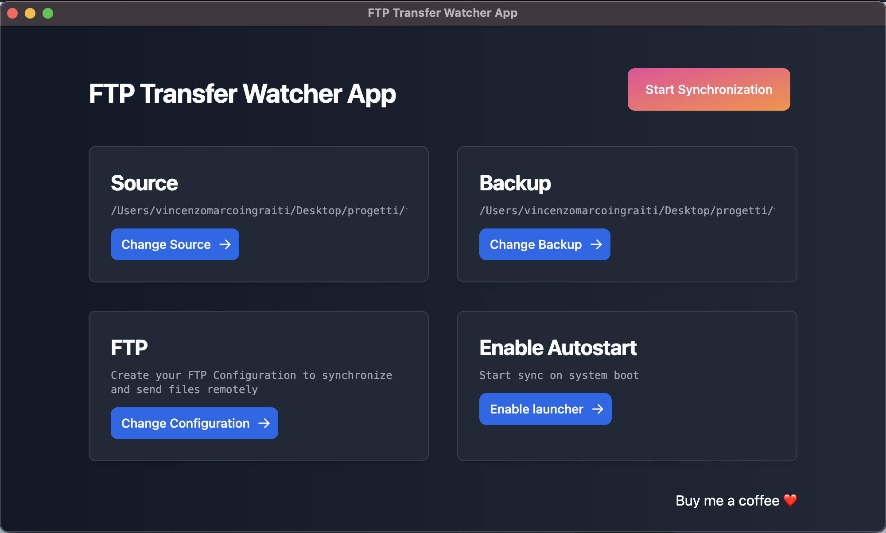

# FTP Transfer Watcher App

Source of Electon Desktop app to synchronize changes in local folder to FTP remote server.

Any files added or changed in a **source** folder, we're moved to Remote FTP and moved to backup folder.

## Use cases

You will need it in case you want to keep a remote folder updated via FTP from a local folder, like system integrations solutions.

## Contribute or use it

Clone the repo, install dependecies and run
`npm start`

## Download

Soon I will publish compiled package for Windows, Linux and MacOS
